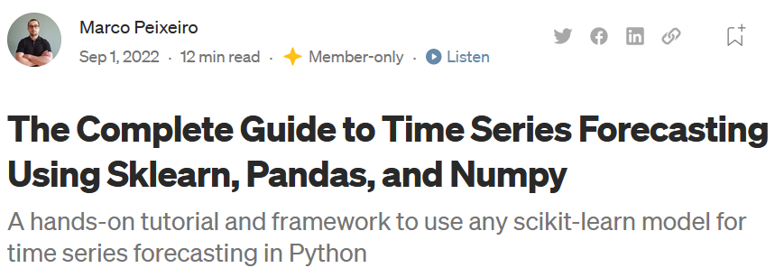
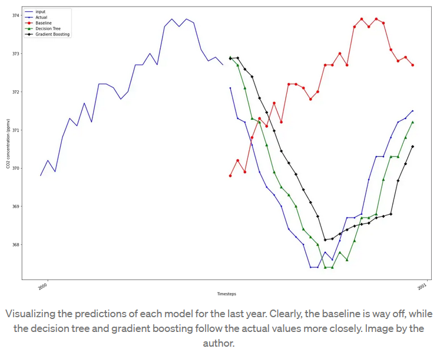
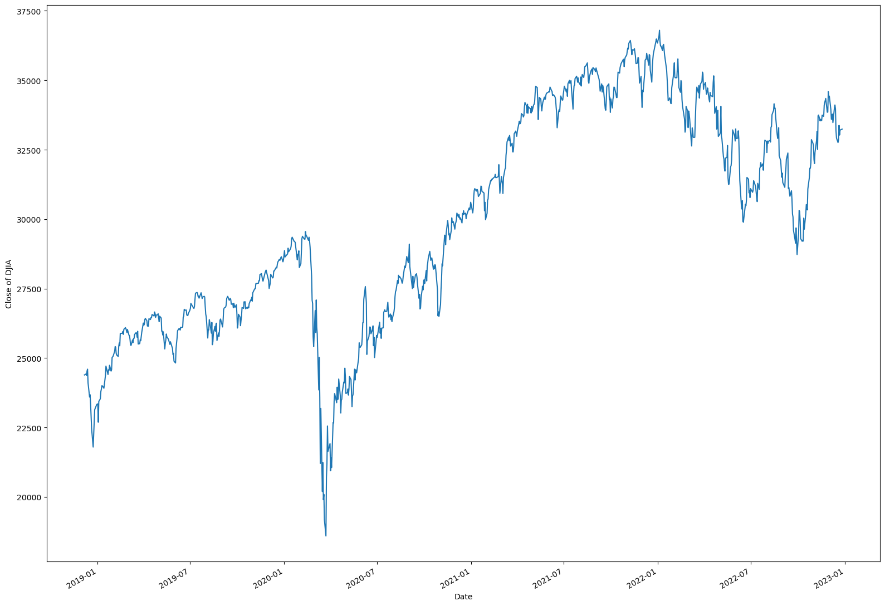
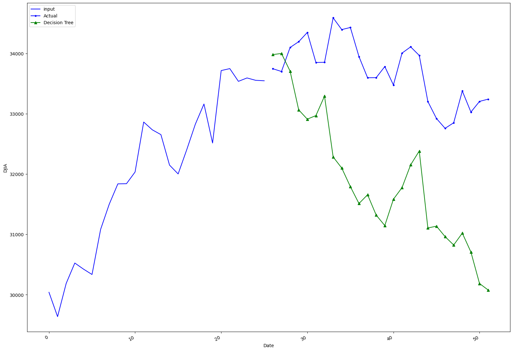
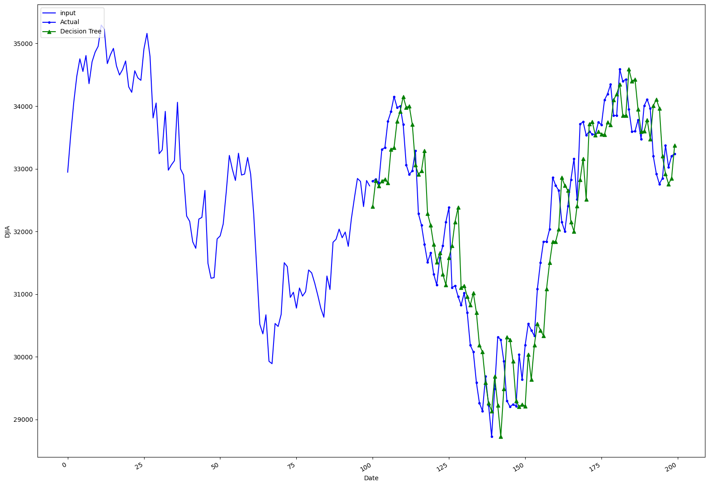
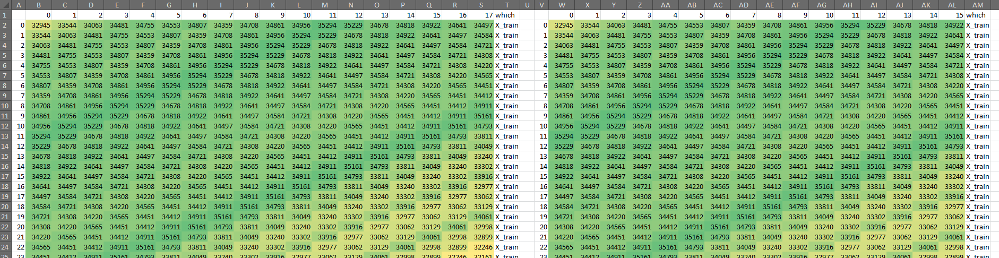
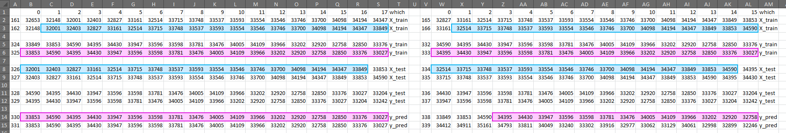
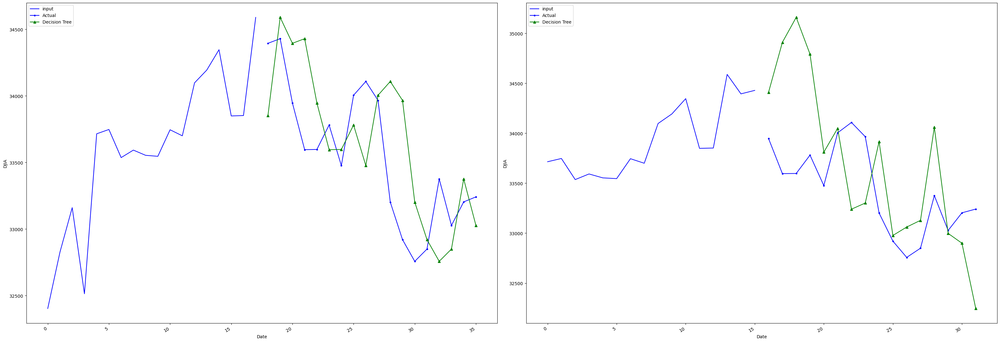

# Pitfalls of time series forecasting strategies
*Critical review of a popular tutorial*

<h2 style="text-align: center;">Abstract</h2>

A popular online tutorial provides a seemingly easy and straight-forward
strategy to forecast time series data. However, I believe, it is flawed.
His models know future data and thus are able to perform really well, too well.
Beyond this specific application, this points at some broader issues with 
current machine learning and Data Science culture, which I outline at the end of
this sheet. 

## Introduction
Recently I found this promising article:
["The Complete Guide to Time Series Forecasting Using Sklearn, Pandas, and Numpy"](https://towardsdatascience.com/the-complete-guide-to-time-series-forecasting-using-sklearn-pandas-and-numpy-7694c90e45c1)
The author apparently has thousands of followers and telling from the "claps",
he recieved for this article, it appears fairly popular.



After a few steps, the guide ends with a plot which shows a great accuracy in 
predicting CO² concentration in the atmosphere using the DecisionTreeRegressor algorithm 
from sklearn. 



Wow! It nearly looks like it is exactly correct, just two steps behind 
(spoiler: keep that in mind).


## Replication
If I could have such a great prediction for my stock data, I´ll be rich in no time, 
I thought.
Said, done, I got daily data for the DowJones from [here](https://www.measuringworth.com/) 
and adapted his code.
First, I got rid of all his introductory stuff, heading straight to boundless wealth. 
After reading in my data and cropping it to increase speed, I can display my data, too.

```python
import numpy as np
import pandas as pd
import statsmodels.api as sm
import matplotlib.pyplot as plt
from sklearn.tree import DecisionTreeRegressor

data = pd.read_csv("djia.csv")
data.index = pd.to_datetime(data['date'], format='%Y-%m-%d')
del data['date']
data = data[36673:]

fig, ax = plt.subplots(figsize=(16, 11))

ax.plot(data['close'])
ax.set_xlabel('Date')
ax.set_ylabel('Close of DJIA')

fig.autofmt_xdate()
plt.tight_layout()
```


Great, now I copied his functions, kept his prediction window and ran the model.
```python
def mape(y_true, y_pred):
    return round(np.mean(np.abs((y_true - y_pred) / y_true)) * 100, 2)


def window_input_output(input_length: int, output_length: int, data: pd.DataFrame) -> pd.DataFrame:
    
    df = data.copy()
    
    i = 1
    while i < input_length:
        df[f'x_{i}'] = df['close'].shift(-i)
        i = i + 1
        
    j = 0
    while j < output_length:
        df[f'y_{j}'] = df['close'].shift(-output_length-j)
        j = j + 1
        
    df = df.dropna(axis=0)
    
    return df


#set up model and run it
seq_df = window_input_output(26, 26, data)

X_cols = [col for col in seq_df.columns if col.startswith('x')]
X_cols.insert(0, 'close')
y_cols = [col for col in seq_df.columns if col.startswith('y')]

X_train = seq_df[X_cols][:-2].values
y_train = seq_df[y_cols][:-2].values
X_test = seq_df[X_cols][-2:].values
y_test = seq_df[y_cols][-2:].values

dt_seq = DecisionTreeRegressor(random_state=42)
dt_seq.fit(X_train, y_train)
dt_seq_preds = dt_seq.predict(X_test)

#plot the prediction
fig, ax = plt.subplots(figsize=(16, 11))
ax.plot(np.arange(0, 26, 1), X_test[1], 'b-', label='input')
ax.plot(np.arange(26, 52, 1), y_test[1], marker='.', color='blue', label='Actual')
ax.plot(np.arange(26, 52, 1), dt_seq_preds[1], marker='^', color='green', label='Decision Tree')
ax.set_xlabel('Date')
ax.set_ylabel('DJIA')
plt.legend(loc=2)

fig.autofmt_xdate()
plt.tight_layout()
```


... meh... this is disappointing. Ok, it got the direction correctly but his seemed 
way better. Well, Stock data may be something different... 
But let´s give it one more try with a different input and prediction window. 

```python
#set up model and run it
seq_df = window_input_output(100, 100, data)

X_cols = [col for col in seq_df.columns if col.startswith('x')]
X_cols.insert(0, 'close')
y_cols = [col for col in seq_df.columns if col.startswith('y')]

X_train = seq_df[X_cols][:-2].values
y_train = seq_df[y_cols][:-2].values
X_test = seq_df[X_cols][-2:].values
y_test = seq_df[y_cols][-2:].values

dt_seq = DecisionTreeRegressor(random_state=42)
dt_seq.fit(X_train, y_train)
dt_seq_preds = dt_seq.predict(X_test)

#plot the prediction
fig, ax = plt.subplots(figsize=(16, 11))
ax.plot(np.arange(0, 100, 1), X_test[1], 'b-', label='input')
ax.plot(np.arange(100, 200, 1), y_test[1], marker='.', color='blue', label='Actual')
ax.plot(np.arange(100, 200, 1), dt_seq_preds[1], marker='^', color='green', label='Decision Tree')
ax.set_xlabel('Date')
ax.set_ylabel('DJIA')
plt.legend(loc=2)

fig.autofmt_xdate()
plt.tight_layout()
```


Wow! Now this is something, I am just two days behind the performance of the DowJones!<br>
Finally, I´ll be as rich as Jakob Fugger (https://en.wikipedia.org/wiki/Jakob_Fugger)! <br>
Wait, I´ll apply at Warren Buffett´s Berkshire Hathaway! <br>
Wait, I should have entitled this work "How to make endless money in no time"! <br>
No, wait, I shouldn´t tell anyone!

## The Puzzle

Ok... As you might have guessed by now, this is simply wrong. 
No one can predict stock data that accurately.
So, what is going on here? 

Well, in the comments section, some have expressed concerns that 
"The reason those models look good is that they've snooped on future data 
and learned from it!". However, the author insists, that 
"The model doesn't train on future values!". Although he later admits, that 
he does not actually predict 26 steps at once, how his diagram suggests, but only one a 
time (I believe that this is also not entirely correct, but let´s put that aside for the
moment). Anyway, it still looks like a suspiciously great - simply a lagged - prediction.

If one runs his code with several setups of prediction lengths and dataset rows, strangely,
one gets some predictions that closely follow the actual data with a lag of two 
(like my second trial), three 
or five steps but some that are completely off (like my first try above). 

So does his model really "snoop on future data"? An obvious way to
check that, is to simply see which data the model trains on and which data it predicts.
I exported these sets to csv-Files.

```python
X_train_df = pd.DataFrame(X_train)
X_train_df["which"] = "X_train"
y_train_df = pd.DataFrame(y_train)
y_train_df["which"] = "y_train"
X_test_df = pd.DataFrame(X_test)
X_test_df["which"] = "X_test"
y_test_df = pd.DataFrame(y_test)
y_test_df["which"] = "y_test"
y_pred_df = pd.DataFrame(dt_seq_preds)
y_pred_df["which"] = "y_pred"


all_dfs = pd.concat([X_train_df, y_train_df, X_test_df,y_test_df,y_pred_df], ignore_index = True)
all_dfs.to_csv(f"{inp_len}_inp_{len(data)}rows.csv")
```

We take a look at these files for two different input parameters:
200 rows and 16 vs 18 predictive steps. For 16, prediction is way off
for 18, it works with lag of two. 
In Excel, the concatenated
files for both iterations look like below. 
To the left, the data for 16, to the right the data for 18 predicted steps.
I coloured them based on the value in order
to make the shifting pattern visible. 



Now how do we get any insights regarding the question, whether the data knows
the future beforehand or not?
In his code, he "reserves" the last two rows for testing. The following illustration
is the same file, limited 
to the last two rows of the X_train, the y_train, the X_test, the y_test and the y_pred
(the latter three only have two rows). Now we can take a closer look.



At first glance there is no obvious relationship between these rows
but if one looks closely, there is 
some kind of repeating pattern. 

**It turns out that, within the X_train data, the model 
already receives exactly that sequence of numbers we later ask it to predict (blue box). 
It also gets to know what outcome (y_train) this input produces (upper pink box), which
is exactly the sequence it outputs when asked to make predictions (lower pink box).**

So, from my point of view, the data *did* "snoop" on future data, which is why it can make
such accurate predictions.

## Open Questions

***The 18- and 16-step models both produce partially lagged result. 
Why does the 16-step-plot still look so bad in the chart?***

If we look at the above Excel-Snippet once again, we can see that it works perfectly
for the left side (18 steps to predict) but not quite as good for the right side (16 steps).
But still: most of the pattern is correct (bottom right pink box). 
However, when looking at the plots using the code from
above, we can clearly see that the partially correct prediction from the 16-step-model
is not visible in the plot. 
Instead, the second row (or the last row) of the prediction is plotted, which is way off. 
For the 18-steps-prediction this makes no difference because both rows are identical.



So which of these values make it in the plot and why?
The Author even states before running the model, that 
"Here, we reserve the last two rows for the test set, as it gives us 52 test samples."
However, when it comes to the plot, he only plots the latter 26, the second row, of them. 
It seems a bit like he lost track of what he was trying to achieve, because the second row
to predict ("test samples" 27 to 52 in his language) is nearly identical to the first. 
One value at the beginning of the first row is unique and one value at the end of the 
second row is unique since they are lagged by 1. 
So basically: It seems like he is only predicting 
28 unique values (because samples 2 to 26 and 27 to 51 are the same), he believes he
predicts 52 and in the end he plots 26. 

This answers why the graphical prediction for 16 
is so much worse than for 18 (because he plots the worse part of the results). 
But it does not answer why the two rows yield identical prediction for 18 but not for 16.
I have to admit, I have know idea why this is happening. I suspect it has something to
do with the line breaks generated by the lagged variables and the way
DecisionTreeRegressor handles the input data.
If someone can explain it, 
I would be happy to hear from you. 

***Why are some predictions a lag of two/three/five and other completely off track?***

As we have seen by now, only some setups of data size and steps to predict yield
a lagged prediction. To illustrate this point, I ran the above code with a
combination of several setups, always computing the MAPE, using his function from
above, as this value may be an indicator of a lagged - better, low MAPE - prediction.

```python
def n_inp_combinations():
    list_of_n_and_inp = [range(300, 2100, 200), range(10, 201, 1)]
    all_combinations = list(itertools.product(*list_of_n_and_inp))
    return all_combinations


data = pd.read_csv("djia.csv")
data.index = pd.to_datetime(data['date'], format='%Y-%m-%d')
del data['date']
data = data[27673:]

all_mape = []
all_n = []
all_inp = []
for n, inp in n_inp_combinations():
    data_n = data[n:]
    out = inp
    seq_df = window_input_output(inp, out, data_n)
    X_cols = [col for col in seq_df.columns if col.startswith('x')]
    X_cols.insert(0, 'close')
    y_cols = [col for col in seq_df.columns if col.startswith('y')]

    X_train = seq_df[X_cols][:-2].values
    y_train = seq_df[y_cols][:-2].values

    X_test = seq_df[X_cols][-2:].values
    y_test = seq_df[y_cols][-2:].values

    dt_seq = DecisionTreeRegressor(random_state=42)

    dt_seq.fit(X_train, y_train)

    dt_seq_preds = dt_seq.predict(X_test)
    mape_dt_seq = mape(dt_seq_preds.reshape(1, -1), y_test.reshape(1, -1))

    all_n.append(n)
    all_inp.append(inp)
    all_mape.append(mape_dt_seq)

df = pd.DataFrame({'n': all_n, 'inp': all_inp, 'mape': all_mape})
df = df.pivot(index="inp", columns="n", values="mape")
df.plot.line()
df.to_csv("mapes.csv")
plt.show()
```


This is ... interesting. We can see that it depends both on the size of the data set
and the horizon we want the model to predict. For the example above, 
we can see the difference between 16, displaying a high green peak left to the 
"25" tick on the x-axis and 18, the deep valley right afterwards. 

We can also see, that most of the time, n is less relevant than the input and prediction
horizon for the test data. Interesting is also that for all numbers of n except for
the those with the greatest value (1700 and 1900) there is a peak at the inp parameters
41 to 44. All lines reach a plateau between 47 and 64 and sharply drop afterwards. If one
looks closer into the models at this part, it seems that the prediction is repeating 
most of the test input horizon, which, more or less accidentally produces high MAPE
(if the Dow had had a flat graph during that time it would be a perfect strategy). 

Apart from describing what is happening here, we would like to know *why* it is 
happening. Again, I have to admit, I have no idea. Again, if somebody has a better
understanding of what is going on, I am happy to hear from you.
However, it seems to me that 
such a strange pattern is yet another indicator, that the research strategy suggested
in this article is not ideal - to put it mildly. 

## Summary and Conclusion

The article mentioned at the beginning suggested an easy and straight-forward approach
to using "any scikit-learn model" for time series forecasting. I demonstrated in this
review why I believe it is flawed. The main critic being, that its prediction using
DecisionTreeRegressor is simply a lagged version of the actual data. This is likely
caused by partial inclusion of test data as training data. 
Some other strange outcomes are produced by this analytic strategy. However, I am
not completely sure about their causes.

So, why bother? If this strategy for time series forecasting does not work, simply 
use others which do, right? Well, I believe there is more to learn from this than 
how to set up an analytic strategy for this particular purpose. 

### Know your data.

Knowing your data is essential for meaningful insights. Often, 
"getting to know the data" means looking at the first five and last five rows and 
probably some summary statistics. This is a good start, but during the project,
data is manipulated, aggregated, interpolated, lagged, and so on. Although most
of these tasks usually work as expected, it would not hurt to take a look at the 
data, preferably at more than ten rows, whether everything is still correct.

Basically: Know your data. Not only at the beginning but throughout your 
workflow. Not only the first 5 rows, but also what happens where in your data.

### Be critical.

Data Scientist, just like any scientist, try to describe phenomena,
detect relationships, make predictions. To put it more general and pathetic:
Explaining the world around us. But this world is complex and our data usually
covers only a tiny fraction of the environment we want to explain. 

Therefore,
when drawing conclusions, one should always ask: Are there alternative explanations?
Is my result valid? Is it reliable (reproducible) for similar contexts?
And even if the answer is favorable, being humble in your claims and 
keeping in mind that others might have reasonable critics and "comments"
is always a good advice.

In that sense:<br>
If I am completely mistaken here and there is in fact nothing wrong with the analysis
I criticised in this sheet, please let me know, 
I would love to understand the issue in more detail.


